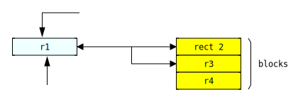

# td2svg
Javascript text (ascii) diagrams to svg

It is a very simple (and limited) translator from ascii diagrams to svg.

## Why another implmementation?

There are many applications and libraries for doing this. None of them fulfill my needs. 
I want a very simple (and efficient) javascript library for writing disgrams in my documents.
In particular, I need to write diagrams with text, boxes, lines and arrows.

## Features

Each box (rectangle) can have an identifier or class, so you can add styles to them.
You can write your own styles belos of diagram as the next example:

```
+-----------------------------------------+ \
|#p        Programas de usuarios          | |
|  ofimática, navegador web, juegos, ...  | |
+-----------------------------------------+ | modo usuario
|#s     Herramientas del sistema          | |
|   biblioteca estándar, linker, shells,  | |
|        servicios (impresión, ...)       | |
+-----------------------------------------+ /
|#k             OS kernel                 |<- modo supervisor
+-----------------------------------------+ 
|.hw             Hardware                 |
|  CPUs, Memoria (RAM), discos, red, ...  |
+-----------------------------------------+

<style>
.hw {fill: crimson;}
#k {fill: coral;}
#s {fill: cornflowerblue;}
#p {fill: cyan;}
</style>;
```

## API

Call `td2svg(d)` where `d` is a string containing the diagram text. It will return a string with the *svg* code.
When using client-side (browser), then You can generate a DOM element (`<figure>`, for example) with the svg content inside.

Ouput of above diagram example:


