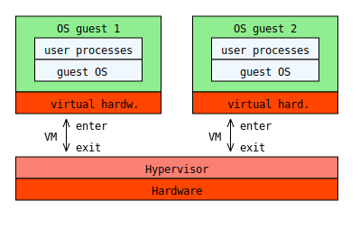

# td2svg: Javascript text (ascii) diagrams to svg.

It is a simple (and limited) translator from ascii diagrams to svg.
This simple javascript code has no dependencies and it cab be used in node.js or in a browser.
This script is used in the docsify-td2svg plugin.

The main feature and difference with other tools is you can add identifiers or classes to boxed for styling.
Yo can put the `<style>` tag at the end of the diagram. It will be included in the resulting svg.

## Why another implementation?

There are many applications and libraries for doing this. None of them fulfill
my needs.  I want a very simple (and efficient) javascript library for writing
disgrams in my documents.
In particular, I need to write diagrams with text, boxes, lines and arrows.

## Features

Each box (rectangle) can have an identifier or class in the upper-left corner. 
It enable us to adding styles to them.
You can write your own styles below of diagram as in the next example:

```
  +----------------------+    +----------------------+
  |.vm   OS guest 1      |    |.vm   OS guest 2      |
  |  +----------------+  |    |  +----------------+  |
  |  | user processes |  |    |  | user processes |  |
  |  +----------------+  |    |  +----------------+  |
  |  |   guest OS     |  |    |  |    guest OS    |  |
  |  +----------------+  |    |  +----------------+  |
  +----------------------+    +----------------------+
  |.hw  virtual hardw.   |    |.hw  virtual hard.    |
  +----------------------+    +----------------------+
          ^ enter                   ^ enter
       VM |                      VM |
          v exit                    v exit
  +--------------------------------------------------+
  |#hv                 Hypervisor                    | 
  +--------------------------------------------------+
  |.hw                  Hardware                     |
  +--------------------------------------------------+

  <style>
  .vm {
    fill: lightgreen; 
    filter: drop-shadow(0px 4px 4px rgba(0, 0, 0, 0.4));
  }
  #hv {
    fill: salmon;
    filter: drop-shadow(0px 4px 4px rgba(0, 0, 0, 0.4));
  }
  .hw {
    fill: orangered;
    filter: drop-shadow(0px 4px 4px rgba(0, 0, 0, 0.4));
  }
  rect {fill: AliceBlue;}
  </style>
```

In the above example, the hardware box has the `hv` (hypervisor) identifier.
Other rectangles have a class name.

## API

Call `td2svg(d)` where `d` is a string containing the diagram text. It will
return a string with the *svg* code.  When using client-side (browser), then you
can generate a DOM element (`<figure>`, for example) with the svg content
inside.

Ouput of above diagram example:



## To do

1. Support for unicode characters
2. Shapes width rounded borders
3. Recognize other shapes
